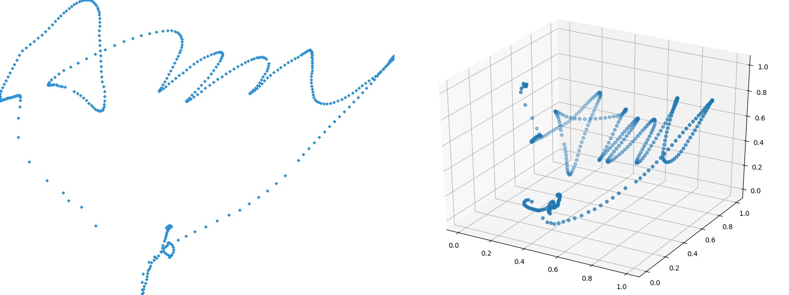

# NCUHandwrite Dataset
<center class="half">
</center>
 
 
This dataset contains handwritten trajectories in English and Chinese, called "en_dataset" and "ch_dataset".

"en_dataset" contains the handwritten of 10 girl and 5 boy, each person has 50 2D/3D positive and 50 negative samples.</br> 
"ch_dataset" contains the handwritten of 12 peoples , each person has 100 2D/3D positive and 60 negative samples. 

Download link: [Google Drive](https://drive.google.com/file/d/1ArwilcXXtIqXw5iPgi8IVQFb6GuU3LvC/view?usp=sharing)

## Drawing
**Please install opencv-python, matplotlib, numpy.** 

**Drawing img parser format:**
```
python3 parser.py [JSON_PATH] [OUT_IMG_PATH]
```
**you can use the two commands specify to draw 2D/3D images**
```
python3 parser.py [JSON_PATH] [OUT_IMG_PATH] -2d
python3 parser.py [JSON_PATH] [OUT_IMG_PATH] -3d
```
**or use "-s" to show the control UI**
```
python3 parser.py [JSON_PATH] [OUT_IMG_PATH] -s
```

**an Example:**
```
python3 parser.py ch_dataset/ymz/3d/pstv/0.json out.jpg -s
```

_For more details, please refer to "example.py"_
